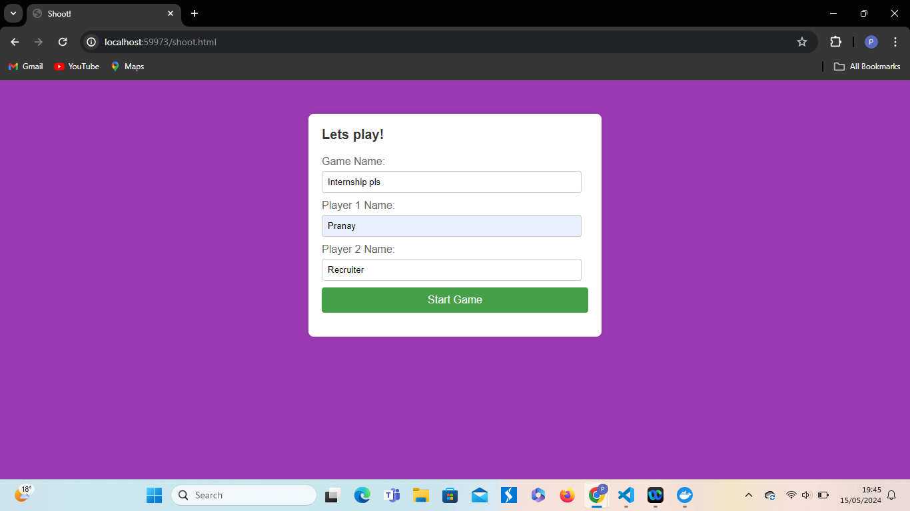
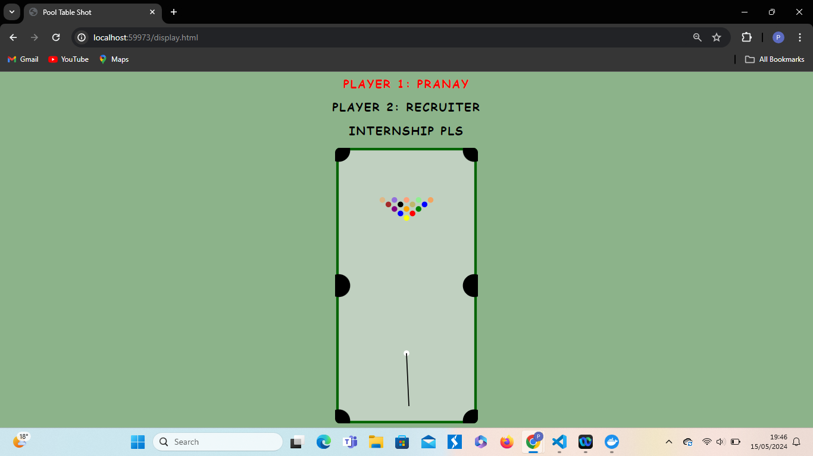
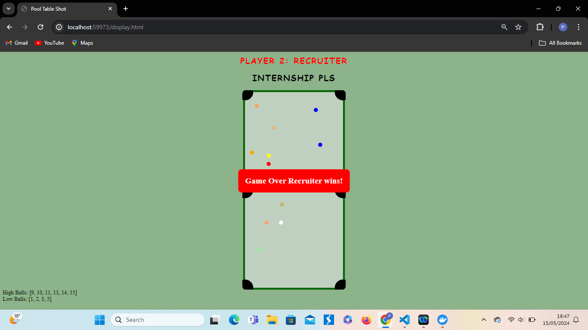

# Pool Game Application

## Table of Contents

- [Introduction](#introduction)
- [Features](#features)
- [Technology Stack](#technology-stack)
- [Installation](#installation)
- [Usage](#usage)
- [Screenshots](#screenshots)
- [Contributing](#contributing)

## Introduction

Welcome to the Pool Game Application! This is a full stack web application that simulates a pool game. The game features realistic physics, allowing players to enjoy a smooth and engaging experience.

## Features

- Realistic physics using a C library, allowing for precise ball movements and collision handling.
- Backend scripting and server handling with Python.
- SQLite database to store game and player information.
- Interactive front end built with HTML, CSS, and JavaScript.
- Easy-to-use interface for entering game and player information.

## Technology Stack

- **C**: Physics engine for the game.
- **Python**: Backend and scripting.
- **Swig**: To connect Python and C code.
- **SQLite**: Database management.
- **JavaScript**: Frontend interactivity.
- **HTML/CSS**: Frontend structure and styling.

## Installation

To run this application, follow these steps:

1. **Clone the repository**:

    ```bash
    git clone <repository_url>
    cd <repository_directory>
    ```

2. **Install dependencies**:

    Ensure you have Python installed. Install the required Python packages:

    ```bash
    pip install -r requirements.txt
    ```

3. **Compile the C code**:
    Use the following command to compile the C code:

    ```bash
    gcc -c physics.c -o physics.o
    gcc -shared -o libphysics.so physics.o
    ```

4. **Run the application**:

    ```bash
    python app.py
    ```

## Usage

1. Open your browser and go to `http://localhost:5000`.
2. Enter the game name and player names when prompted.
3. Start the game and enjoy! You can drag the cue ball to play.

## Screenshots

Here are some screenshots of the application:

### Home Screen



### Game Setup



### Game Ending



## Contributing

Contributions are welcome! Please open an issue or submit a pull request for any improvements or bug fixes.
